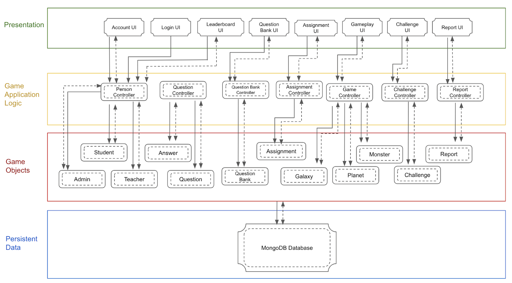

# GalaxSE
CZ3003 - Software System Analysis &amp; Design

Our product aims to gamify and socialize teaching and learning. An in-depth project description and software requirements specifications can be found [here](https://github.com/Aditya239233/GalaxSE/tree/main/docs)

## Product Scope

GalaxSE System consists of a desktop game application and a web application. The GalaxSE Game application
will facilitate the teaching and learning of Software Engineering courses through a gamified and socialized
approach. It aims to stimulate the learning interests of Students by providing a fun and interactive learning
platform that Students can use outside of the classroom. Furthermore, GalaxSE Game comes with analysis
features that use machine learning to enhance Students’ learning experience by adjusting the difficulty of the
game to ensure Students are progressing at their own pace.

The Teachers WebApp provides convenience to Teachers through its analysis tool and assignments feature. It
allows Teachers to manage and test their Students through custom-made assignments. It provides an efficient
analytical tool that allows Teachers to understand the Students’ game progress and assess their overall mastery
of the course. This information can be used for adjusting teaching content and key points during classroom
teaching. Lastly, it allows the Teachers to make changes to the GalaxSE Game application if any modification
of game content is necessary.

## System Architecture

## Contributors

* SWATHI KUMAR VEMBU
* NISHKA KHENDRY
* ADITYA CHANDRASEKHAR
* TEO WEE REN
* TAN YI HENG
* SWATI SURESH
* BANKATA MISHRA SPRIHA
* TAMMY LIM LEE XIN
* PHAM TAN ANH KHOA
* REENASHINI RAJENDRAN#
